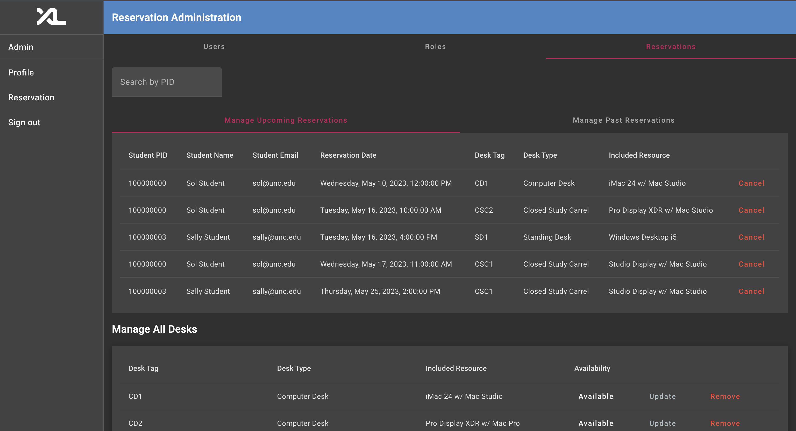

# Student Desk Reservations Feature

Authors:
- [Kailash Muthu](https://github.com/kailash-unc)

## Application Design
- The following are the two main views that encompass the Desk Reservation System.
    - Student View
    
    - Admin View
    

## Application Overview

- The purpose of the project's feature is to create a Desk Reservation System and allow students to reserve for a desk at The Experience Lab (XL). The primary use for the application will be for UNC-Chapel Hill Computer Science students who want to reserve a desk to study, as well as use an included desktop resource for work. This will bring so many values to the community because having these resources at a university is not very common, and reserving a table Experience Lab (XL) will enable UNC students to have different experiences.

## Development Breakdown
- In order to understand the full-overview and implementation of the application, it is important to understand how the desk reservation system is created in both the front-end and backend. Thorough details will be provided on feature implementation such that future changes are much more easily and readily be able to implemented and modified in the application.

### Backend

- In order to understand the backend implementation, it is pertinent to explore the application structure in the order of `models`, `entities`, `services`, and `api`, respectively.
    1. `models`: the structure of the objects maintained throughout the application
        The desk resevation system is created based on the models **models/desk_reservation.py** and **models/desk.py**.
        - The desk model encompasses the following fields: **id: int**, **tag: str**, **desk_type: str**, **included_resource: str**, and **available: bool**
        - The desk reservation model encompasses the following fields: **id: int**, and **date: datetime** 
    2. `entities`: the structure of the database tables containing the infomation designed with SQL Alchemy.
        The desk reservation system contains entities of the following entities/desk_reservation_entity.py and entities/desk_entity.py 
        - The **entities/desk_reservation_entity.py** contains mapped columns to **id: int**, **date: datetime**, **desk_id: int** (Foreign Key), and **user_id: int** (Foreign Key). It also contains relationship to **desk** (one-to-one) and **user** (one-to-one) tables.
        - The **entities/desk_entity.py** contains mapped columns to **id: int**, **tag: str**, **desk_type: str**, **included_resource: str**, and **available: bool**. It also contains a relationship to the **desk_reservations** (one-to-many) table.
        - It is important to note that the user entity has a relationship to **desk_reservations** (one-to-many) table, in order for this feature to work.
    3. `services`: contains method queries using SQL Alchemy ORM to obtain information for the table
        The desk reservation system contains applicable services of the following services/desk.py and services/desk_reservation.py
        - The services/desk.py contain service methods pertaining to obtaining desk information from the database. Method names are verbose enough to understand the purpose of the method. The breakdown of all methods are as follows:
            - list_all_desks (admin)
            - list_available_desks
            - create_desk (admin)
            - remove_desk (admin)
            - toggle_desk_availability (admin)
            - get_desk_by_id
            - update_desk (admin)
        - Methods marked as (admin) are those that require permission and is handled by _permission.enforce(subject, 'admin/', 'desk'). Please read the auth.md for more information.

        - The services/desk_reservation.py contain service methods pertaining to obtaining desk reservation information from the database. Method names are verbose enough to understand the purpose of the method. The breakdown of all methods are as follows:
            - remove_desk_reservation
            - create_desk_reservation
            - list_reservations_by_desk
            - list_desk_reservations_by_user
            - remove_old_reservations (admin)
            - list_past_desk_reservations_for_admin (admin)
            - list_future_desk_reservations_for_admin (admin)
        - Methods marked as (admin) are those that require permission and is handled by self._permission.enforce(subject, 'admin/', 'desk_reservation'). Please read the auth.md for more information.
    4. `api` : contain api method calls to access desk and desk reservation information.
        The desk reservation system contains api methods in the following directories api/desk.py and api/desk_reservation.py.
        - The api/desk.py contain the following api methods, the action of the methods are verbose from the method name. The HTTP method type will be marked along with it.
            - list_all_desks (GET) /api/desk
            - list_available_desks (GET) /api/desk/available
            - create_desk (POST) /api/desk/admin/create_desk
            - remove_desk (POST) /api/desk/admin/remove_desk
            - toggle_desk_availability (PUT) /api/desk/admin/toggle_availability
            - get_desk_desk_id (GET) /api/desk/{desk_id}
            - update_desk (PUT) /api/desk/admin/update_desk/{desk_id}

        - The api/desk_reservation.py contain the following api methods, the action of the methods are verbose from the method name. The HTTP method type will be marked along with it.
            - list_all_desk_reservations_for_admin (GET) /api/reservation/admin/all
            - list_future_desk_reservations_for_admin (GET) /api/reservation/admin/future
            - list_past_desk_reservations_for_admin (GET) /api/reservation/admin/past
            - remove_old_desk_reservations (DELETE) /api/reservation/admin/remove_old
            - list_desk_reservations_by_user (GET) /api/reservation/desk_reservations
            - list_desk_reservations_by_desk (GET) /api/reservation/{desk_id}
            - create_desk_reservation (POST) /api/reservation/reserve
            - remove_desk_reservation (POST) /api/reservation/unreserve
        
### Frontend
- The frontend of the application is broken down to 7 relevant files:
    - desk.service.ts (service)
        - The desk service contains all methods that provide connection to the back-end api to provide information and functionality to all things related to the desk in the desk reservation system. 
    - desk-reservation.service.ts (service)
         - The desk-reservataion service contains all methods that provide connection to the back-end api to provide information and functionality to all things related to the desk in the desk reservation system. 
    - reservation/* (main component)
        - This is the component that pertains to .ts parsing on fields and variables and methods that ultimately make the reservation component work, as well as .html and .css design. It contains methods to view all desks, view all desk-reservations, and make and cancel a desk reservations.
    - reservation-dialog/* (component)
        - This is the component that pertains to .ts visual of the desk reservation prompt that allows for user entry to choose a date and time and confirm their desk reservation.
    - admin-reservaton/* (component)
        - This is the component that pertains to .ts parsing on fields and variables and methods that make the admin reservation view work, allowing for admin user to view all desks, all desk reservations by users, as well as all past desk reservation by users. It also contains .html and .css to create the design of the application.
    - admin-desk-dialog/* (component)
        - This is the component that handles visual of desk information edit such that the admin is able to edit the information regarding the desk and create an informative decision of changing the fields of the application.
    - confirmation-dialog/* (component)
        - This is the component that handles desk-reservation delete history confirmation that requires the user to understand that upon click, will delete older than 30 days old reservations. We do have a protection system in place such that if the admin user accidentally does click confirm, the application deletes "older" than 30 days of reservation entries. The is an important design decison as no matter what, we want for the admin to still be able to view the past 30 days of desk reservations just in case on incidents.
    
## Design Overview

- In the **Reservation-Feature**, the goal of the feature was to create a easy to access reservation system for students. The implementations were done in 3 general steps:
1. Creating a database using **SQLAlchemy** to store available desks and student users.
    - The database was created using `Model` and `Entities`. Entities involved naming the table and assigning the fields to their appropriate data types.
    - Foreign keys were also implemented in this step where in `desk_reservation_entity.py`, there was a foreign key for the desk with desk ID. `desk_id: Mapped[int] = mapped_column(ForeignKey('desk.id'), nullable=True)`.

2. Creating Front-end interface for the students to reserve a desk.
    - Angular was used to develop the front-end interface.
    - `desk-reservation.service.ts` was created to integrate the back-end with front-end. Inside the Desk Reservation Service, there was a call to **create reservation** and **cancel reservation**.
    - 2 Components were created: `reservation-dialog` and `reservation`. The purpose of the `reservation-dialog` component was to allow students to select the date they want to reserve the desk and populate the data with the `reservation` service.
3. Creating a Back-end to integrate with front-end to view real-time access to the database.
    - `Reservation` Service was also created in the back-end to define all the functions necessary to reserve a desk or look at the available desks. In the Reservation Service, there were functions such as `list_available_desks`, `list_desk_reservation_by_user`, `create_desk_reservation`, `remove_desk_reservation`, etc. All of the functions used SQLAlchemy to select the needed values from the database.

## Implementation Notes

- The database/entity-level representation involves 2 main aspects, `Desk` and `Desk Reservation`. The purpose of creating the `Desk` entity was to initialize all the desks that are available in the Experience Lab (XL). Creating this model/entity was the first step because without having any desks, students would not be able to reserve any desks. The `Desk` entity invovles fields `id`, `tag`, `desk_type`, `included_resource`, and `available`. These fields are very important to distinguish the different desks that are all available in the lab. The `Desk Reservation` Entity was used to create a relationship between the desk and reservation system. Since the reservation system would require what desk was reserved by a student, it was important to create a relationship between the `User` entity and `Desk` entity. `Desk Reservation` entity allows the bonding between the 2 entities.

- In the Reservation System implementation, there were some design choices that the I made to allow easier way for users to reserve a desk. In order to reserve a desk, the user will first have to create a new profile after they log-in. We chose to have users sign-up with a profile over allowing them to create a reservation without creating a profile because we thought it was important for the students to create a profile before they reserve anything. This way, the database will be able to track first name and last name along with their PID instead of just having an access to the PID.